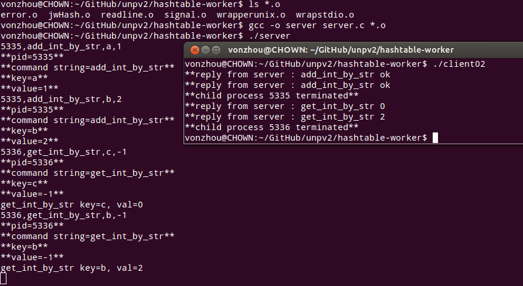

# Hash Table in multi processes
---

## Context

Multiple processes will use one hash table to maintain the global states

a global cannot work after fork

maybe you can use key-value db such as Redis, it is easy 

but when I use it in Mininet host , it cannot work bcs the Namespace 

So, I use a worker process to maintain the hash table, others processes send command to it.

Yes, it turns to be a simple local key-value store server.

## Implementation

* IPC use FIFO pipe
* the protocol is a line(pid + cmd_str + key + value) for simple
* hash table I use [jwHashTable]()

## TODO

A strong protocol to support more messages.

## Run Test

use example see [server.c](server.c), [(client02.c](client02.c)

