# Posix 消息队列
---

### 创建消息队列   [mqcreate1.c](mqcreate1.c) 

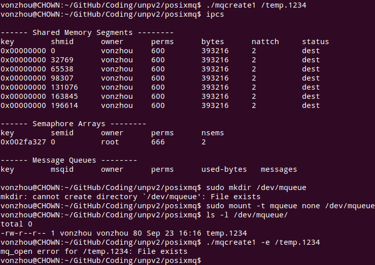

**注意两点：**1） 消息队列指定的路径名只能以/开头，和*shm_open*是一样的;2)posix消息队列没有通过ipcs命令展示出来，创建/dev/mqueue并mount可以使其显示在文件系统中。

### 删除一个消息队列   [mqunlink.c](mqunlink.c)

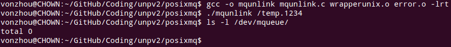

### 获得消息队列属性    [mqgetattr.c](mqgetattr.c) 

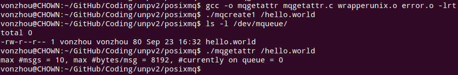

### 创建消息队列,指定队列长度和最大消息大小    [mqcreate.c](mqcreate.c) 

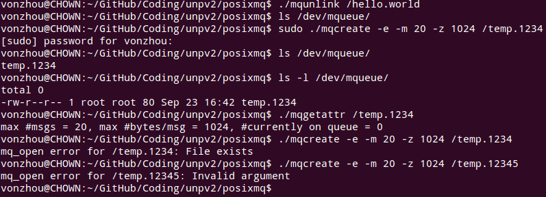

可以看到执行该程序需要sudo，为何？

### 往消息队列发送消息   [mqsend.c](mqsend.c)

### 从消息队列接收消息    [mqreceive.c](mqreceive.c)

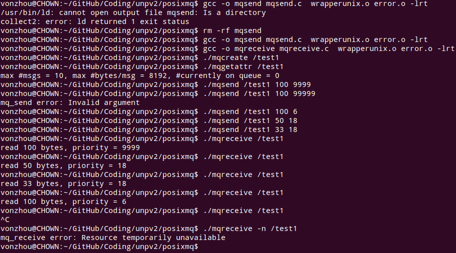

### 消息队列限制  

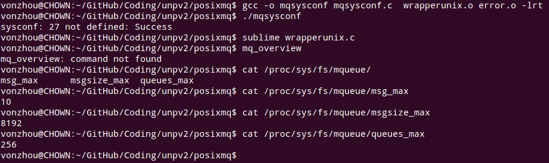

### 消息队列非空信号通知，版本1    [mqnotifysig1.c](mqnotifysig1.c)

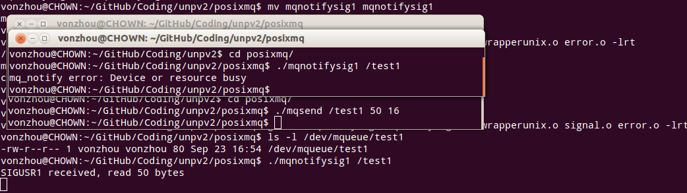

### 信号处理程序中只设置一个标志，版本2    [mqnotifysig2.c](mqnotifysig2.c)

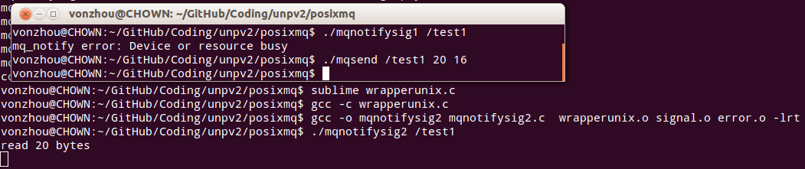

### 正确版本：当mq_notify产生信号时，使用非阻塞mq_receive读消息队列 [mqnotifysig3.c](mqnotifysig3.c)

### 使用sigwait同步地等待异步信号通知 [mqnotifysig4.c](mqnotifysig4.c)

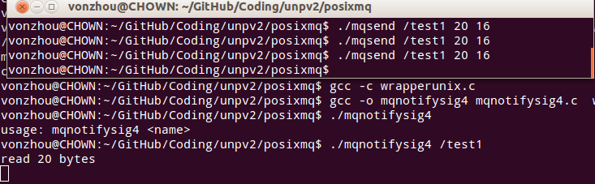

### 使用select的posix消息队列，需要技巧  [mqnotifysig5.c](mqnotifysig5.c)

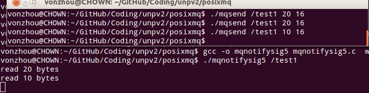

### 启动一个线程处理消息到达队列的处理 [mqnotifythread1.c](mqnotifythread1.c)

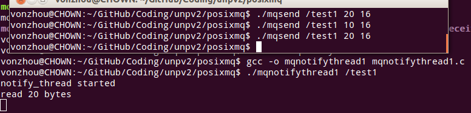

### 使用内存映射实现posix消息队列 [my_pxmsg_mmap](../my_pxmsg_mmap)

